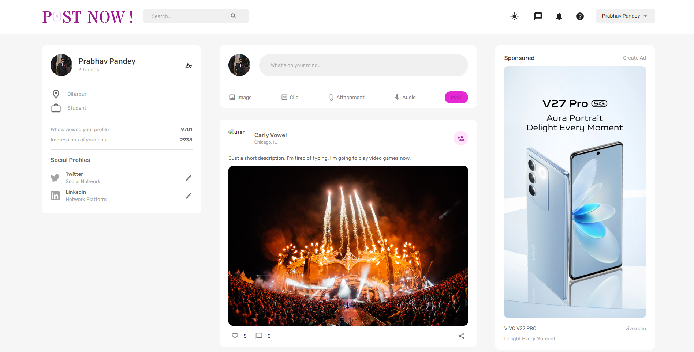
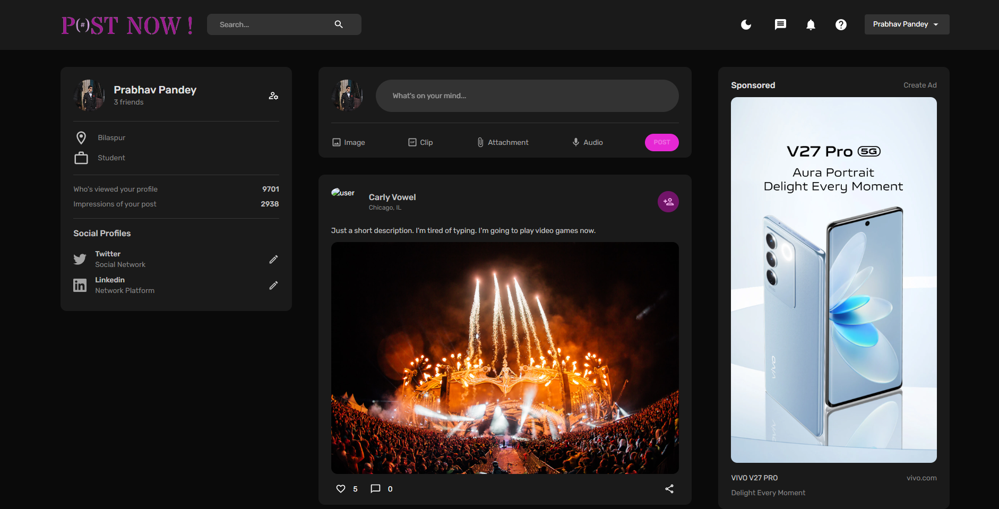
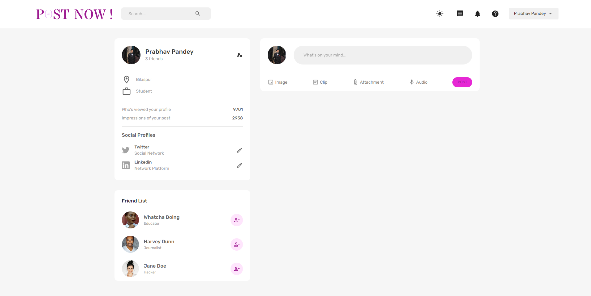
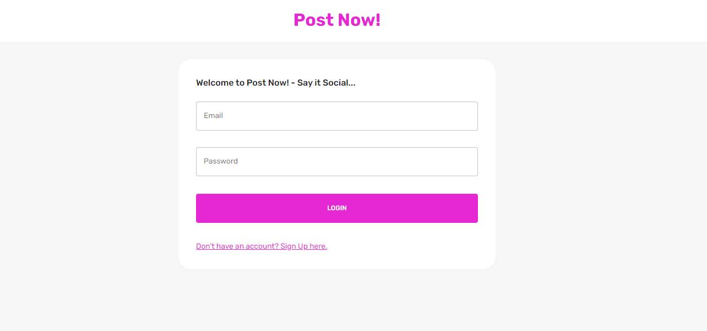
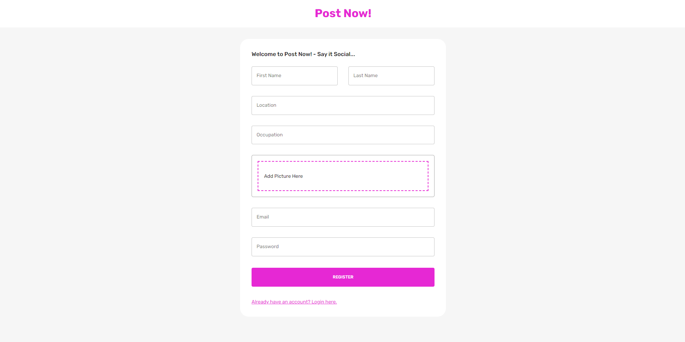

<<<<<<< HEAD
<<<<<<< HEAD
# POST NOW - Say it Social...

"Post Now" is a social media application developed using MERN (MongoDB, Express.js, React, and Node.js) stack. The application is designed to allow users to post their thoughts, ideas, and opinions on various topics and share them with their friends and the wider online community.

## Features
**"Post Now"** offers the following features to its users:

- **User Authentication and Authorization:** Users can sign up and log in using their email address and password. The application employs JWT (JSON Web Token) for user authentication and authorization.

- **Post Creation:** Users can create posts with text, images, and links. 

- **Post feed:** Users can view posts from people they follow on their newsfeed. 

- **Like and Comment:** Users can like and comment on posts. They can also reply to comments.

- **Follow and Unfollow:** Users can follow and unfollow other users.

## Screenshots

**Home Page**

**Dark Mode**

**User Widget**

**Login Page**

**SignUp Page**

## Technology Stack:
**"Post Now"** is developed using the MERN stack, which includes:

- **MongoDB:** The database used to store user information, posts, and other data.
- **Express.js:** The web framework used to build the backend server.
- **React:** The frontend library used to build the user interface.
- **Node.js:** The runtime environment used to execute server-side JavaScript.

## Future Scope:
- **Admin Panel:** The application has an admin panel where the administrator can manage users, posts, categories, and other settings.

- **Profile Management:** Users can update their profiles by adding their profile picture, name, and bio.

- **Search:** Users can search for posts by keywords, categories, and hashtags.

- **Notification:** Users receive notifications for likes, comments, and new followers
=======
=======
>>>>>>> f276186 (Updated Readme file)

# POST NOW - Say it Social...

"Post Now" is a social media application developed using MERN (MongoDB, Express.js, React, and Node.js) stack. The application is designed to allow users to post their thoughts, ideas, and opinions on various topics and share them with their friends and the wider online community.

## Features
**"Post Now"** offers the following features to its users:

- **User Authentication and Authorization:** Users can sign up and log in using their email address and password. The application employs JWT (JSON Web Token) for user authentication and authorization.

- **Post Creation:** Users can create posts with text, images, and links. 

- **Post feed:** Users can view posts from people they follow on their newsfeed. 

- **Like and Comment:** Users can like and comment on posts. They can also reply to comments.

- **Follow and Unfollow:** Users can follow and unfollow other users.

## Screenshots

**Home Page**

**Dark Mode**

**User Widget**

**Login Page**

**SignUp Page**

## Technology Stack:
**"Post Now"** is developed using the MERN stack, which includes:

- **MongoDB:** The database used to store user information, posts, and other data.
- **Express.js:** The web framework used to build the backend server.
- **React:** The frontend library used to build the user interface.
- **Node.js:** The runtime environment used to execute server-side JavaScript.

## Future Scope:
- **Admin Panel:** The application has an admin panel where the administrator can manage users, posts, categories, and other settings.

- **Profile Management:** Users can update their profiles by adding their profile picture, name, and bio.

- **Search:** Users can search for posts by keywords, categories, and hashtags.

- **Notification:** Users receive notifications for likes, comments, and new followers

<<<<<<< HEAD
>>>>>>> e8773d9 (Edited Readme file)
=======
>>>>>>> f276186 (Updated Readme file)
